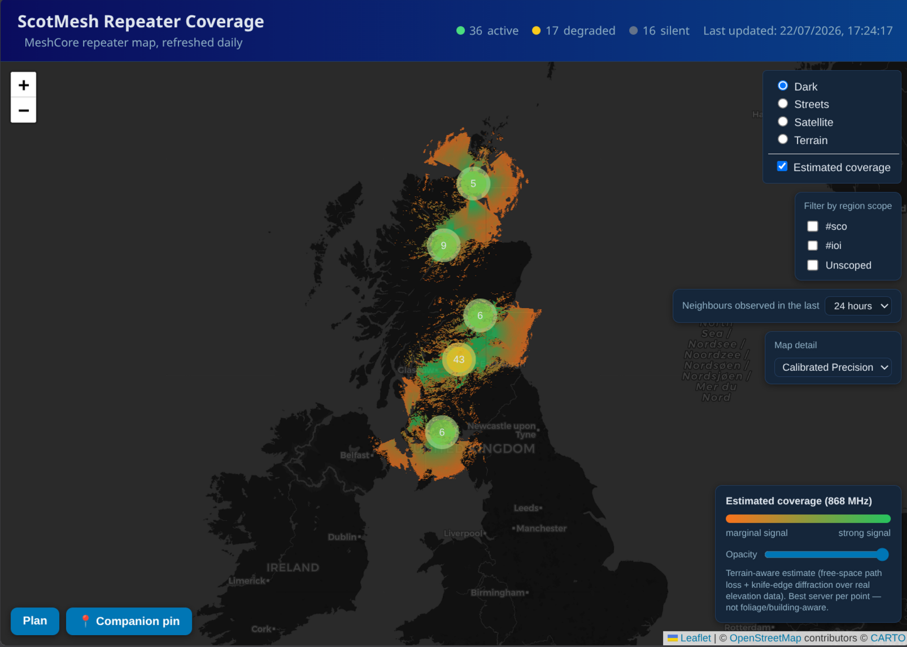
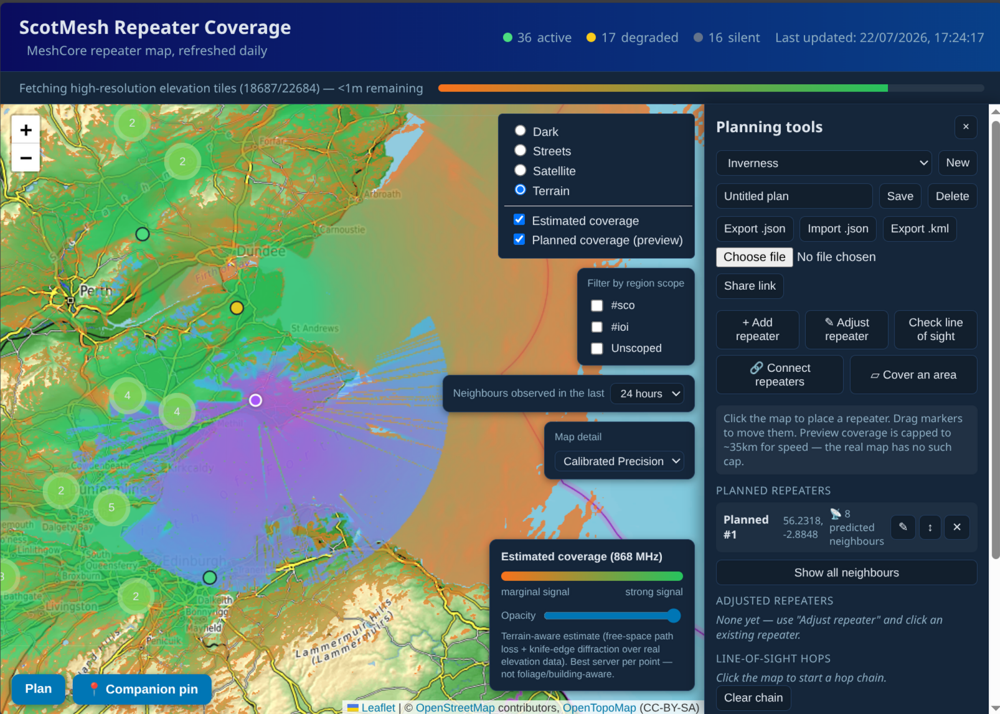
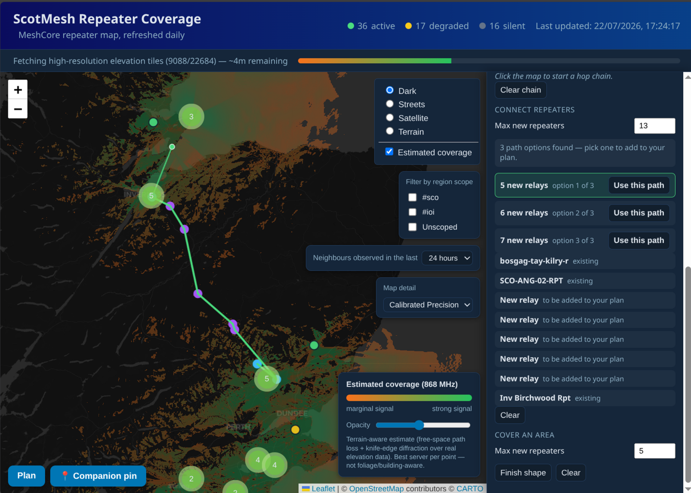

<p align="center">
  
</p>

# HopReach

Interactive coverage map for [MeshCore](https://meshcore.co.uk/) repeater
networks, sourced from a [CoreScope](https://github.com/Kpa-clawbot/CoreScope)
instance. A Go program fetches all `role=repeater` nodes, keeps the ones
inside your configured region, and computes a **terrain-aware estimated RF
coverage map** — real elevation data, line-of-sight/diffraction analysis per
path, not a distance circle — writing a GeoJSON file plus four coverage
heatmap PNGs (reported vs. [calibrated](#position-calibration) positions,
each at standard and
[high-resolution](#map-detail-four-coverage-images-one-dropdown) detail,
optionally [GPU-accelerated](#gpu-accelerated-coverage-compute-optional))
that a static Leaflet map renders. Runs as a single Docker container that
refreshes the data on a daily cron schedule, with a progress bar in the UI
while the terrain computation runs.

Ships with Scotland as the built-in default region, but isn't hard-wired to
it — see [Region](#region-not-just-scotland) for pointing it at any other
area.

> ⚠️ **Vibe-coded software.** This project was built with heavy AI
> assistance rather than fully by hand. The core physics (propagation
> model, terrain grid) is cross-checked between the server and the
> WebAssembly build it shares with the browser — see
> [WASM shared core](#wasm-shared-core) — and it's been exercised against
> real data, but it hasn't had independent human code review. Read the
> source yourself before relying on it for anything safety-critical or in a
> professional context.



## Quick start

```bash
git clone https://github.com/A13xB0/hopreach.git
cd hopreach
cp config.example.yaml config.yaml   # defaults to Scotland, CPU compute — edit freely, see Configuration below
docker compose up --build
```

Open `http://localhost:8080`. That's the whole setup for **CPU** compute —
works on any machine, no GPU required, and is the default.

Coverage computation (the slow part — see [Run it](#run-it)) can run
substantially faster on a GPU instead, in two forms:

| | Extra setup | Use when |
|---|---|---|
| **CPU** (default) | none — the steps above | always works, no GPU needed |
| **Local GPU** | `cp docker-compose.override.yml.example docker-compose.override.yml`, then `docker compose up --build` | this machine has a Vulkan-capable GPU |
| **Remote GPU** | see [Remote GPU worker](#remote-gpu-worker) | this machine has no GPU (e.g. a VPS) but another one on your network does |

Roughly 50x faster on a GPU (local or remote) than CPU for the same raster —
`gpu.mode: auto` in `config.yaml` (the default) uses one automatically if
available and falls back to CPU otherwise, so it's always safe to try. See
[GPU-accelerated coverage compute](#gpu-accelerated-coverage-compute-optional)
for the full picture, including NVIDIA (needs the
`nvidia-container-toolkit` runtime, not covered by the override file above).

## Region: not just Scotland

A repeater is kept if it's **geographically inside the configured region**:
by default that's Scotland's ADM1 boundary (mainland + all islands, ~166
sub-polygons) from [geoBoundaries.org](https://www.geoboundaries.org)
(source: Eurostat-GISCO, CC BY 4.0), embedded into the Go binary at build
time via `go:embed`. Each repeater's `(lat, lon)` is tested against that
polygon with ray-casting — a real border/coastline check, not a bounding box.

To cover a different area, set `region.boundary_path` (a local GeoJSON file
— Feature, FeatureCollection, or bare Polygon/MultiPolygon geometry are all
accepted) or `region.boundary_url` (downloaded once and cached) in
`config.yaml`. [geoBoundaries.org](https://www.geoboundaries.org) publishes
a `gjDownloadURL` for most countries/administrative regions — e.g.
`https://www.geoboundaries.org/api/current/gbOpen/USA/ADM1/` — or point it
at any other GeoJSON boundary source. `region.name` labels the result in
`meta.json`; set it alongside a custom boundary so the frontend/API describe
your region instead of defaulting to "Scotland".

Optionally, `region.required_scope` (empty/disabled by default) can
additionally require CoreScope's reported `default_scope` (the node's most
recently observed MeshCore hashtag scope) to match a given region tag —
useful if a CoreScope instance's operators consistently self-tag, but off by
default since not every repeater broadcasts one.

## How the coverage estimate works

This is real per-path terrain analysis, not a density heuristic:

1. **Elevation data.** [Mapzen/AWS "terrarium" tiles](https://github.com/tilezen/joerd/blob/master/docs/formats.md)
   (global coverage, PNG-encoded, no API key) covering every repeater's
   possible range are downloaded once and cached in a Docker volume —
   terrain doesn't change, so this isn't repeated on every cron run — then
   assembled into an in-memory elevation grid (`terrain.dem_zoom`, default
   11, is roughly 40m/pixel over Scotland).
2. **Per-repeater siting.** Each repeater's transmit height = its ground
   elevation (read straight from the grid) + `propagation.antenna_height_m`
   (default 1m — most repeaters are not on proper masts, window/balcony/
   eye-level mounting is typical). This has a bigger effect on realism than
   the link budget numbers, since it changes actual line-of-sight geometry
   on every path, not just the loss budget. Coverage computation is
   parallelized across all CPU cores (measured ~4-5x speedup on a 12-core
   machine).
3. **Per-pixel, per-repeater path analysis.** For every point on the output
   raster and every repeater within `propagation.max_range_km`, the tool
   walks the great-circle path between them at DEM resolution, corrects
   each terrain sample for earth curvature (standard k=4/3 refracted-earth
   model), finds the worst obstruction relative to the direct line between
   transmit and assumed receive height (`propagation.rx_height_m`, default
   2m), and computes:
   - free-space path loss at that distance and `propagation.frequency_mhz`,
     plus
   - single-knife-edge diffraction loss from that obstruction (the ITU-R
     P.526 single-edge method — a well-established simplification of the
     fuller Bullington/multi-edge construction, assuming one dominant
     obstruction per path rather than several in series).

   That gives a received signal margin in dB. Each point is coloured by its
   **best server** (the repeater giving the strongest margin there), from
   **orange** (just barely covered) to **green** (comfortable margin, ≥
   `propagation.margin_green_db`). Points no repeater reaches with positive
   margin are left transparent.

**Caveats, stated plainly:** single-knife-edge diffraction (not full
Bullington/multi-edge or a statistical model like Longley-Rice), no foliage
or building modeling, and a flat assumed receiver height rather than the
receiving station's own local terrain. Treat this as a genuine first-order
RF prediction grounded in real terrain — a strong planning aid — not a
licensed link-survey replacement.

## Position calibration

A repeater's self-reported GPS position is sometimes off by tens to hundreds
of metres, or just wrong — which throws off the terrain model's prediction
for every path from that site. CoreScope's `/api/nodes/:pubkey/reach`
endpoint reports real *observed* relay links between repeaters — ground
truth, independent of the reported position — so the nightly job always
uses it to find a better position for repeaters whose reported one doesn't
line up with what's actually been heard:

1. For each repeater with at least `calibration.min_links` observed reach
   links, **score** its reported position: for every observed link, if the
   terrain model's predicted margin falls short of a "comfortable" signal
   (`propagation.margin_green_db` — the same threshold the map's own
   orange→green colouring uses), add a penalty proportional to that
   shortfall, weighted by `log(1 + bottleneck)` (CoreScope's own
   weaker-direction observation count — how confidently that link is real).
   This is deliberately a *shortfall* penalty, not just "did it break" — a
   position with excellent margin everywhere and one with only just-barely-
   positive margin everywhere would score identically under a broken/not-
   broken test, which let early versions of this search trade a repeater's
   genuinely excellent siting (e.g. full 360° hilltop visibility) for a
   merely-still-working one, as long as nothing actually crossed zero. An
   unobserved-but-model-predicts-reachable pair is **never** penalized: mesh
   traffic doesn't necessarily exercise every viable route within the
   observation window, so absence of a recorded link is weak evidence at
   best. Lower score = the model already explains what's been heard,
   comfortably.
2. For repeaters whose score exceeds `calibration.needs_score` (only those —
   cheap, and doesn't touch positions that already fit), search a bounded
   ring of candidate positions out to `calibration.max_offset_m` (default
   300m) and adopt the best-scoring one, but only if it improves the score
   by at least `calibration.min_improvement_pct` (default 20%) — avoids
   jittering a repeater that's already a reasonable fit. Each repeater is
   corrected independently in one pass (v1 doesn't chase circular refinement
   between neighbours).
3. Coverage is computed for reported positions (`coverage.png`) and
   calibrated positions (`coverage-calibrated.png`) — the corrected
   positions become a second, switchable dataset rather than silently
   overriding what operators reported. See "Map detail" below for the other
   two images generated alongside these.

## Map detail: four coverage images, one dropdown

The map shows a **Map detail** dropdown (below the scope-filter checkboxes)
with four options, each pairing a repeater position set with a raster
resolution:

| Option | Positions | Raster width | Elevation data |
|---|---|---|---|
| Standard | reported | `coverage.image_width` (default 2000px) | `terrain.dem_zoom` (default 11, ~42m/px) |
| Calibrated | calibrated | `coverage.image_width` | `terrain.dem_zoom` |
| Precision | reported | `coverage.precision_width` (default 6000px) | `coverage.precision_dem_zoom` (default 13, ~10.5m/px) |
| Calibrated Precision | calibrated | `coverage.precision_width` | `coverage.precision_dem_zoom` |

Precision/Calibrated Precision use the same physics and positions as their
Standard/Calibrated counterparts, but genuinely finer input: a wider raster
alone can't show more real detail than the elevation data it's sampling, so
Precision loads its own finer DEM grid rather than interpolating the
Standard pass's coarser one. The frontend also renders Precision/Calibrated
Precision with nearest-neighbour (not smoothed) pixel scaling when zoomed
in, so the raster's real per-pixel detail shows as crisp edges rather than a
blurred gradient. All four are always computed (no feature flag); compute
cost scales roughly with width² (and a finer DEM means more elevation tiles
on first run, cached afterwards) — see `coverage.precision_width` /
`coverage.precision_dem_zoom` in `config.example.yaml` for reference points,
and "GPU-accelerated compute" below for cutting the compute cost down
substantially on capable hardware.

Switching the dropdown swaps both the displayed repeater positions and the
coverage overlay; the planning tools (add-repeater prediction, line of
sight, companion pin, personal adjustments) all use whichever positions are
currently selected. A repeater's popup shows a "Calibration" row whenever it
was scored, with the offset distance and before/after score, so the
correction is always inspectable, never silent.

## GPU-accelerated coverage compute (optional)

Coverage computation — the same free-space-path-loss + knife-edge
diffraction math described above — can run on a GPU via
[WebGPU](https://github.com/rajveermalviya/go-webgpu) (`wgpu-native`,
running on Vulkan on Linux) instead of CPU. This is purely an accelerator:
the output is verified against the CPU path (on a synthetic fixture, at
startup) before it's ever trusted, and any GPU error mid-run falls back to
CPU for that pass automatically. `gpu.mode`:

- `auto` (default): probe for a real GPU (a software Vulkan rasterizer like
  `llvmpipe` doesn't count — it would only ever be slower than native CPU)
  and use it if found and verified, otherwise CPU. Silent and safe on any
  machine, including ones with no GPU at all — which is most deployments,
  since this needs the *host* to actually have Vulkan-capable hardware and
  the container to be given access to it.
- `cpu`: skip the probe entirely.
- `gpu`: force it — a hard error instead of a silent fallback if it's
  unavailable or fails verification, useful when you specifically want to
  confirm it's working rather than silently not engaging.

To actually opt in, uncomment the `devices: ["/dev/dri:/dev/dri"]` line in
`docker-compose.yml` (AMD/Intel via the Mesa Vulkan driver already installed
in the image; NVIDIA needs the `nvidia-container-toolkit` runtime instead,
not covered here). Without that, `auto` simply never finds anything and
always uses CPU — zero risk, zero behaviour change.

Measured on a mid-range discrete GPU (AMD RX 5700 XT): roughly 50x faster
than CPU for the same raster, including at `coverage.precision_dem_zoom`'s
full default (13) — a whole-Scotland elevation grid at that zoom is several
GB, comfortably past WebGPU's own ~2GB single-buffer ceiling (an API/spec
limit baked into `wgpu-native` even for this native, non-browser build —
confirmed via `vulkaninfo` that the actual Vulkan device supports far more),
so it's uploaded across multiple buffer bindings
(`internal/gpucompute`) rather than avoiding the GPU for large grids. Two
other real failure modes turned up and were fixed during development, both
worth knowing about if you're tuning `coverage.precision_dem_zoom` /
`coverage.precision_supersample` further: large dispatches are internally
split into small row-chunks so a single GPU submission never runs long
enough to trip the driver's own hang-detection watchdog (crossing that
threshold aborts the whole process with an uncatchable native panic, not a
normal Go error); and the elevation grid's scratch file must live on
genuinely disk-backed storage (`terrain.dem_cache_dir`) rather than the OS
default temp directory, which is `tmpfs` (RAM-backed) on some hosts and
would silently defeat the point of memory-mapping a multi-GB grid in the
first place.

The progress bar shows which backend actually served each coverage pass —
`CPU`, `GPU`, or `Remote GPU` — so it's always visible at a glance whether a
given run actually used the accelerator or fell back.

### Remote GPU worker

If the machine actually running this stack has no GPU at all (a low-powered
VPS, say — the intended production home for this project), a *separate*
machine that does have one can run as a remote compute worker instead of
leaving every pass on CPU. Two extra pieces, both optional and off by
default:

- **`cmd/hopreach-gpuworker`** (`docker-compose.gpuworker.yml`) runs on the
  GPU machine — same GPU init/verify discipline as local GPU mode (never
  trusts an unverified device), and never accepts a job unless that passed.
  It connects *out* to the VPS (the expected topology: the worker is behind
  home/office NAT with no public IP, so outbound-initiated is the only
  practical direction) over WebSocket and fetches/caches its own DEM tiles
  locally — the VPS never ships the (potentially multi-GB) elevation grid
  over what's likely also a modest-bandwidth link, only the small job
  description (bounds, sites, propagation params) and the resulting margins
  array cross the wire. This binary is configured via its own environment
  variables (`GPU_BROKER_WS_URL`, `GPU_WORKER_TOKEN`, etc. — see
  `docker-compose.gpuworker.yml`), not `config.yaml`: it's a small,
  standalone deployment on a different machine entirely, so there's no
  shared config file to read.
- **The VPS side** is handled by `cmd/hopreach-shareapi` (the existing small
  always-on process that already serves shared plans) — it gains a
  WebSocket endpoint (`/gpu-worker`, proxied by nginx since it's the one
  part of this that needs to be reachable from outside) for the worker to
  connect to, plus a local-only route the batch job calls to submit a pass
  and get a result back. `compute.Engine.Margins` (`internal/compute`)
  tries local GPU, then a connected remote worker, then CPU, in that order —
  each failure falls through to the next exactly like the existing
  local-GPU-fails-falls-back-to-CPU path always has.

**Setup**: on the VPS, set `remote_worker.token` to a real generated secret
(`openssl rand -hex 32`) and `gpu.remote.broker_addr: 127.0.0.1:8081` in your
`config.yaml`. On the GPU machine, run
`docker compose -f docker-compose.gpuworker.yml up -d --build` with
`GPU_BROKER_WS_URL=wss://your-vps-host/gpu-worker` and the same token as
`GPU_WORKER_TOKEN`. This token is a real trust boundary, not a formality —
the endpoint is reachable from the public internet, and whoever holds it
could feed fabricated data into the live public map —
`cmd/hopreach-shareapi` refuses to even register the `/gpu-worker` route at
all if it's unset, rather than defaulting to an open endpoint.

**Per-tier GPU gating**: separately, each Map detail tier can be marked as
requiring a GPU (local or remote) to run at all — `coverage.
standard_requires_gpu` / `coverage.calibrated_requires_gpu` / `coverage.
precision_requires_gpu` / `coverage.calibrated_precision_requires_gpu`, all
`false` by default. A gated tier with no GPU available anywhere is skipped
entirely (logged, tier just absent from `meta.json` — the same "optional
tier" shape `Calibrated` already has) rather than silently running a very
slow CPU pass — the most likely thing worth setting on a GPU-less VPS is
gating Precision/Calibrated Precision specifically, since those are the
tiers where CPU compute is least practical at full resolution.

## Planning tools

A "Plan" panel (bottom-left on the map) lets you sketch hypothetical
repeater sites entirely **in the browser** — no server round-trip — using
the same physics as the real map:



- **Add repeater**: click the map to drop a draggable planned site (rename,
  override mast height, or delete it from the panel). A coverage preview
  recomputes automatically (debounced, in a Web Worker so the map stays
  responsive) and overlays in blue→purple — deliberately distinct from the
  real map's orange→green, so "existing" and "proposed" coverage read as
  different things when both are shown at once. The preview is capped to a
  ~35km radius and a coarser DEM zoom for speed; the real nightly map has no
  such cap.
- **Check line of sight**: click a sequence of points (existing repeaters,
  planned ones, or bare clicks) to build a hop chain. Each hop is drawn as a
  line coloured by its computed margin — green (clear), orange (marginal),
  red (blocked or out of range) — with the distance and dB margin listed in
  the panel.
- **🔗 Connect repeaters**: click two existing repeaters and it works out the
  minimum number of *new* repeaters needed to bridge them — reusing any
  existing repeater that already helps along the way (existing
  infrastructure is free to use, a new build isn't). First checks whether
  they're already connected via existing repeaters (0 new repeaters, most
  common case); otherwise tries every reachable pair of bridgeable repeaters
  (not just the closest one) and offers up to 3 distinct route options —
  ranked fewest-new-relays-first — so you can pick between them rather than
  being locked into whichever the search happened to try first. Each
  candidate new site is biased toward higher local ground. The "max new
  repeaters" cap is user-settable (default 6, persisted across visits) — a
  tighter cap fails faster, a looser one lets it search further before
  giving up. This is a heuristic, not a guaranteed-optimal placement search
  (that's a much harder geometric problem) — it mirrors how you'd plan it by
  hand, not a formal solver. New relays land in your plan as ordinary
  planned repeaters (draggable, renameable, deletable).

  
- **▱ Cover an area**: click the map to draw a polygon (up to ~100km
  across), then Finish shape to place up to N new repeaters (settable,
  default 6) for maximal coverage of the enclosed area — reusing whatever
  coverage already exists from real repeaters and anything already in your
  plan first, same "existing infrastructure is free" philosophy as Connect
  repeaters. Uses the standard greedy maximum-coverage heuristic: repeatedly
  place whichever candidate site (biased toward local high ground,
  restricted to strictly inside the drawn shape) newly covers the most
  still-uncovered ground, until the budget runs out or nothing left can
  improve coverage — provably within ~63% of the true optimum, another
  "principled heuristic, not a solver" tool rather than a claim of a perfect
  answer. Tries the search 3 times against slightly shifted candidate grids
  and keeps whichever attempt covers the most ground, since a single fixed
  grid can easily miss the actual best site. Reports the before/after
  coverage percentage of the drawn area, scored at the exact same range the
  map itself will render — a placement crediting coverage from a link the
  map won't draw isn't real coverage — and if it's already fully covered,
  reports that immediately without placing anything.

This works by re-fetching the same
[terrarium elevation tiles](#how-the-coverage-estimate-works) client-side
(via the same `/dem-tiles` nginx proxy, for canvas pixel access without CORS
issues) and running the propagation model through a **WebAssembly module
compiled from the exact same Go code the server uses**
(`internal/propagation` + `internal/demgrid`, via `wasm/main.go`) — not a
hand-ported JS reimplementation. Browser and server share one
implementation bit-for-bit, so there's no separate copy of the physics that
could quietly drift out of sync; only tile fetching/caching (a plain
`fetch()` + canvas decode, not domain logic) stays JS. See
[WASM shared core](#wasm-shared-core) below.

### Personal repeater adjustments

A third plan mode, **✎ Adjust repeater**: click any existing real repeater
to reposition or re-height it for yourself, without touching the shared
nightly data. The repeater's official marker/popup are completely untouched
— the adjustment renders as a separate draggable amber marker, linked to the
real position by a thin dashed line so it's always clear what moved and by
how much. The panel's "Adjusted repeaters" list shows the offset distance, a
mast-height override (same control as a planned repeater's), a
reset-to-original button, and a remove button.

Adjustments feed straight into the same coverage-preview pipeline as
planned repeaters — your browser recomputes their predicted coverage live,
exactly like a brand-new planned site, which is what makes it "personal":
nothing is sent anywhere until you choose to. They save with the plan
(`localStorage`, export/import) and travel with a shared link the same way
— a recipient's browser recomputes the preview from the adjustment data
itself, never a static image, so it stays live and interactive on their end
too.

### Companion pin

A separate, always-available button next to "Plan" (no side panel needed):
drop a single draggable pin anywhere on the map and see who it would likely
reach, using the same terrain physics as everything else. Unlike a planned
repeater, the pin uses `propagation.rx_height_m` (handheld height) rather
than `propagation.antenna_height_m` (mast height) for its own end of the
link, since it's the *receiving* side. Not saved anywhere — it resets on
reload. Search is capped to ~35km and a coarser DEM zoom, same as the
add-repeater preview, for speed.

### Saving and sharing plans

Plans save locally by default: `localStorage` in your browser, with
Export/Import to a `.json` file for manual sharing, or Export to `.kml` for
Google Earth (placemarks for every repeater plus the current coverage
overlay as a ground-projected image). The **Share** button goes further —
it POSTs the plan's structure only (repeater positions, labels, hop chains —
**never** a rendered coverage image, since that's cheap to recompute and
would only go stale) to a small always-on Go server
(`cmd/hopreach-shareapi`, proxied by nginx at `/api/plans`) and returns a
link anyone can open. Shared plans have no auth (anyone with the link can
view) and are deleted after `share.ttl_days` (default 7) by a daily cron job
(`hopreach-shareapi -prune`), the same mechanism that runs the nightly
coverage fetch.

## Progress reporting

The Go program writes `data/progress.json` throughout the run (`stage`:
`fetching_repeaters` → `loading_terrain` → `computing_coverage` →
`fetching_reach_data` → `computing_coverage_calibrated` →
`loading_precision_terrain` → `computing_coverage_precision` →
`computing_coverage_calibrated_precision` → `done`), including which
compute backend (`cpu` / `gpu` / `remote_gpu`) is serving the current
`computing_coverage*` stage. nginx starts immediately on container boot
rather than waiting for the first (slow) run to finish, so the frontend can
poll this file and show a live progress bar with a per-stage ETA and
backend label; it auto-reloads the map data once a run completes.

## WASM shared core

`internal/propagation` (the link-budget/knife-edge-diffraction physics) and
`internal/demgrid` (the elevation grid + bilinear lookup) are compiled twice
from the exact same source: once into the native `hopreach` binary, and
once to WebAssembly (`wasm/main.go`, `GOOS=js GOARCH=wasm`) for the
[planning tools](#planning-tools) to run client-side. This eliminates what
used to be a hand-ported, independently-drifting JS reimplementation of
that same physics — the browser and the server now agree by construction,
not by careful manual porting.

The split follows one rule: anything that's actually *domain logic* (the
propagation model, the terrarium elevation-decode formula, the grid's
bilinear interpolation) runs through the shared Go/WASM module; anything
that's just I/O with no real drift risk (tile fetching, PNG container
decoding via the browser's own `OffscreenCanvas`) stays plain JS. See
`public/wasm-bridge.js`, `public/terrain.js`, and `public/propagation.js`
for the thin JS binding layer.

Local development needs the compiled module (gitignored, built fresh —
see [Local development](#local-development)); the Docker image builds it in
its own stage (see `Dockerfile`).

## Run it

```bash
cp config.example.yaml config.yaml   # adjust if needed — see Configuration below
docker compose up --build
```

Open `http://localhost:8080`. The first run downloads DEM tiles and
computes coverage in the background — watch the in-page progress bar (it
shows a live ETA per stage and which compute backend is serving it). Coverage
is computed four times per run (see "Map detail" above): Standard +
Calibrated at `coverage.image_width` (default 2000px, ~3.5 minutes combined
on a 12-core CPU) plus Precision + Calibrated Precision at
`coverage.precision_width`×`coverage.precision_supersample` internally
(defaults 6000px×2, downsampled back to 6000px before saving — expect the
total nightly run to comfortably exceed an hour on CPU alone at the
defaults). Coverage compute is parallelized across all CPU cores and, if you
have Vulkan-capable hardware and opt into GPU passthrough, can run roughly
50x faster on a GPU instead — see
"[GPU-accelerated coverage compute](#gpu-accelerated-coverage-compute-optional)"
above. Subsequent runs (daily, per `schedule.cron`) reuse the cached DEM
tiles and are compute-only.

The Precision elevation grid at the default zoom (13) needs ~22,700 tiles on
first run for all of Scotland (a few GB on disk, cached in the
`hopreach-dem-cache` volume afterwards) and is several GB in memory while in
use — memory-mapped to a scratch file under that same volume rather than a
plain heap allocation, so it degrades to slower (disk-paged) rather than
crashing under memory pressure. `coverage.precision_dem_zoom` in
`config.example.yaml` has reference points for lighter/heavier settings.

## Configuration

Everything lives in one YAML file — see **`config.example.yaml`** for the
full, fully-documented reference (every field, its default, and why it's
set that way). Copy it to `config.yaml` and edit what you need; anything
you don't set keeps its default. Resolved from (in order) the `-config`
flag, the `HOPREACH_CONFIG` environment variable, or `./config.yaml` — in
Docker, `HOPREACH_CONFIG` is already set to `/config/config.yaml`, which the
image ships a working default at (`docker/config.docker.yaml`); mount your
own file over that same path (see the commented example in
`docker-compose.yml`) to override it. There is no other environment-variable
configuration surface for the `hopreach`/`hopreach-shareapi` binaries.

A quick map of the top-level sections (see `config.example.yaml` for every
field within each):

| Section | Covers |
|---|---|
| `output_dir` | Where `repeaters.geojson`/`meta.json`/coverage tiles are written |
| `site` | Frontend branding, active/degraded/silent status thresholds, scope-filter checkboxes |
| `map` | Initial Leaflet view (center, zoom) |
| `region` | [Region boundary](#region-not-just-scotland), required CoreScope scope |
| `corescope` | Which CoreScope instance to query, request timeout |
| `terrain` | DEM zoom/cache/tile source |
| `propagation` | Link-budget/RF model inputs — see [How the coverage estimate works](#how-the-coverage-estimate-works) |
| `coverage` | Raster resolution, [per-tier GPU gating](#remote-gpu-worker), recompute interval |
| `calibration` | [Position calibration](#position-calibration) thresholds/search bounds |
| `gpu` | Local GPU mode, remote broker address — see [GPU-accelerated coverage compute](#gpu-accelerated-coverage-compute-optional) |
| `schedule` | Cron expression for the daily refresh |
| `share` | Shared-plan store/TTL/listen address |
| `remote_worker` | [Remote GPU worker](#remote-gpu-worker) broker token/timeout |

Two `hopreach` flags sit outside the YAML: `-force` (recompute immediately,
ignoring `coverage.min_recompute_interval_hours`) and `-prepare` (render
`config.js`/nginx's site config/the cron file from `config.yaml` and exit —
what the Docker entrypoint calls at container startup; not needed for local
development or a normal run).

`HTTP_PORT` (host port mapping) is the one thing that stays a plain
`docker-compose.yml`/shell environment variable rather than YAML — it's a
Compose/host-level concern, not something the `hopreach` binary itself ever
reads.

## Local development

```bash
make wasm                       # builds public/hopreach.wasm + copies wasm_exec.js (needed once, or after changing internal/propagation or internal/demgrid)
go run ./cmd/hopreach            # fetches + writes public/data/* (uses ./dem-cache, ./config.yaml if present)
python3 -m http.server -d public 8000
```

`make wasm` is required at least once — the planning tools load
`public/hopreach.wasm` at runtime, and both it and `public/wasm_exec.js` are
generated artifacts (gitignored, not committed) rather than checked in. The
Docker image builds its own copy in a separate build stage, so this step is
Docker-only-deployment-irrelevant; it's purely for running the site locally
without a container.

## License

[AGPL-3.0](https://www.gnu.org/licenses/agpl-3.0.html) plus the
[Commons Clause](https://commonsclause.com/) — see [`LICENSE`](LICENSE) for
the full text. In short: use, copy, and modify freely; if you distribute it
or run a modified version as a network service others can talk to, you must
make the corresponding source available under the same license; you may
**not** sell this software or a service substantially based on it. Provided
free of charge, for personal and non-commercial use, with no warranty and no
support.

## Project layout

```
cmd/
  hopreach/            main binary: fetch → filter → compute → write, plus -prepare
  hopreach-shareapi/   plan-sharing server + remote-GPU broker routes
  hopreach-gpuworker/  remote GPU worker (deployed separately, see docker-compose.gpuworker.yml)
wasm/
  main.go              internal/propagation + internal/demgrid compiled to WebAssembly
internal/
  config/               YAML config schema, Load/Default/Validate
  geo/                  point-in-polygon boundary check, region GeoJSON loading (local/download/embedded default)
  corescope/             CoreScope API client (nodes + reach data)
  progress/              progress.json writer (per-stage ETA, active backend)
  calibration/            position-calibration scoring/search
  compute/                Engine: local GPU → remote GPU → CPU dispatch, in that order
  coverage/                raster rendering + tiling (colour-mapping, supersample+downsample)
  propagation/              the RF/terrain model itself — shared by every compute path, WASM included
  demgrid/                  elevation tile fetch/cache/decode + bilinear grid lookup (Load is native-only; Grid/At/NewFromElev also compile to WASM)
  gpucompute/                GPU-accelerated margins via WebGPU/Vulkan (WGSL port of internal/propagation, verified against CPU before ever trusted)
  gpujob/                     wire-format types shared between the broker, the batch job's remote-dispatch path, and the remote worker
public/
  index.html, app.js, style.css, config.js   map, basemap switcher, legend, opacity control, progress bar
  wasm-bridge.js, wasm_exec.js*, hopreach.wasm*   Go/WebAssembly runtime + the compiled module (*generated, not committed — see Local development)
  terrain.js, propagation.js   thin JS bindings over the WASM module, plus tile fetch/cache (browser fetch + canvas decode)
  planner.js, planner-worker.js   the planning UI (add-repeater, personal adjustments, line-of-sight, connect repeaters, cover an area, save/load/export/import/share, KML export, companion pin)
docker/
  entrypoint.sh          mkdir → hopreach -prepare → cron+tail → background initial run → background share API → exec nginx
  default.conf.template   nginx config (rendered by -prepare): static site, /dem-tiles proxy, /api/plans + /gpu-worker proxies, gzip + MIME for the .wasm module
  config.docker.yaml       the image's built-in config.yaml (container-correct paths); mount your own over /config/config.yaml to override
  gpuworker.Dockerfile, docker-compose.gpuworker.yml   separate build/deploy for the remote GPU worker (a different machine than the main stack)
config.example.yaml   fully-documented config reference — copy to config.yaml
```
